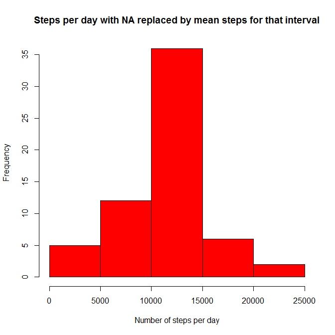

# Reproducible Research: Peer Assessment 1
Dave Richards  
November 14, 2015  


## Assumptions:
- ZIP file containing the dataset has been downloaded and extracted to the working directory `~/R/RepResearch`


## Loading and preprocessing the data

Show any code that is needed to

1. Load the data (i.e. `read.csv()`)

2. Process/transform the data (if necessary) into a format suitable for your analysis


```r
# Loading the data
setwd("~/R/RepResearch/RepData_PeerAssessment1")
actData <- read.csv("activity.csv")
# reformat date to POSIXct
library(lubridate)
actData$date <- ymd(actData$date)
```


## What is mean total number of steps taken per day?
For this part of the assignment, you can ignore the missing values in the dataset.

```r
library(dplyr)
actNoNA <- actData[!is.na(actData$steps),]
# Calculate the total number of steps taken per day
stepsPerDay <-
        actNoNA %>% group_by(date) %>% summarise(totalSteps = sum(steps))
# Make a histogram of the total number of steps taken each day
par(mar=c(4,4,3,1))
hist(
        stepsPerDay$totalSteps, col = "red",
        xlab = "Number of steps per day", main = "Histogram of steps per day"
)
```

 

```r
# Calculate/report the mean and median of the total number of steps taken per day
mean(stepsPerDay$totalSteps)
```

```
## [1] 10766.19
```

```r
median(stepsPerDay$totalSteps)
```

```
## [1] 10765
```

## What is the average daily activity pattern?

```r
# Make a time series plot (i.e. type = "l") of the 5-minute interval (x-axis)
#  and the average number of steps taken, averaged across all days (y-axis)
meanPerInterval <-
        actNoNA %>% group_by(interval) %>% summarise(meanSteps = mean(steps))
# hhmm is interval converted from integer to factor for ease of graphing
library(stringr)
meanPerInterval <-
        mutate(meanPerInterval, hhmm =
               as.factor(str_pad(meanPerInterval$interval, 4, "left", "0")))
plot(
        meanPerInterval$hhmm, meanPerInterval$meanSteps, 
        type = "l", ylab = "Average steps", lwd = 3,
        main = "Average steps per 5-minute interval",
        xlab = "Time of day (HHMM)"
)
```

 

```r
# Which 5-minute interval, on average across all the days in the dataset,
#  contains the maximum number of steps?
meanPerInterval[meanPerInterval$meanSteps == max(meanPerInterval$meanSteps),c(3,2)]
```

```
## Source: local data frame [1 x 2]
## 
##     hhmm meanSteps
##   (fctr)     (dbl)
## 1   0835  206.1698
```


## Imputing missing values

```r
# Calculate and report the total number of missing values in the dataset
#  (i.e. the total number of rows with NAs)
sum(is.na(actData$steps))
```

```
## [1] 2304
```

```r
# Devise a strategy for filling in all of the missing values in the dataset.
#    (Used the mean for that 5-minute interval, stored in meanPerInterval.)
a1 <- full_join(actData, meanPerInterval, by = "interval")
# Create a new dataset that is equal to the original dataset but with the 
#    missing data filled in.
a1 <- transform(a1, steps = ifelse(is.na(steps), meanSteps, steps))

# Make a histogram of the total number of steps taken each day and Calculate and
#   report the mean and median total number of steps taken per day.
a2 <- select(a1, steps, date)
a2PerDay <-
        a2 %>% group_by(date) %>% summarise(totalSteps = sum(steps))
hist(a2PerDay$totalSteps, col = "red",
     xlab = "Number of steps per day",
     main = "Histogram of steps per day with NA replaced by mean steps for that interval")
```

 

```r
mean(a2PerDay$totalSteps)
```

```
## [1] 10766.19
```

```r
median(a2PerDay$totalSteps)
```

```
## [1] 10766.19
```


## Are there differences in activity patterns between weekdays and weekends?

```r
# Create a new factor variable in the dataset with two levels - "weekday" and "weekend" 
#  indicating whether a given date is a weekday or weekend day.
aw <- transform(a1, weekpart = ifelse(wday(date) %in% c(7,1), "weekend", "weekday"))

# Make a panel plot containing a time series plot (i.e. type = "l") of the 
#  5-minute interval (x-axis) and the average number of steps taken, averaged 
#  across all weekday days or weekend days (y-axis).
awMean <-
        aw %>% 
        group_by(weekpart, interval) %>% 
        summarise(meanSteps = mean(steps))
library(lattice)
xyplot(
        log10(meanSteps) ~ interval | weekpart, 
        data = awMean, type = "l", layout = c(1, 2)
)
```

 

